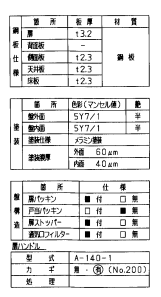
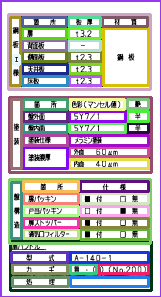
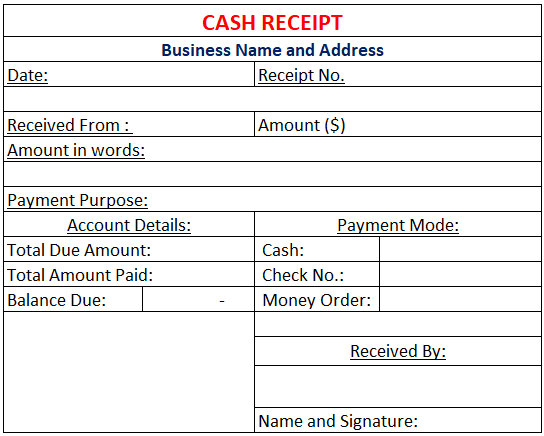
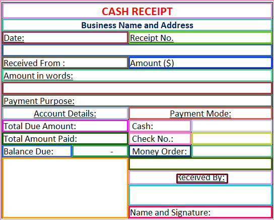

# Table Cell Extraction


This repository consists of a simple image processing script to extract coordinate of each cell in a table image. \
The script can extract tables irrespective of image size. 

The result will be contour image and json output with position of each cell.


## Install Dependencies
```code
pip install -r requirements.txt
```

## Run Table Extraction
```code
python ExtractTable.py -i test_data/test_table1.png
```

## Cell Visualization

Original Image             |  Contour Image
:-------------------------:|:-------------------------:
  |  
  |  


## Cell Coordinate Result

```
{
  "width": 161,
  "height": 297,
  "results": [
    {
      "x": 0,
      "y": 0,
      "width": 161,
      "height": 297
    },
    {
      "x": 10,
      "y": 241,
      "width": 141,
      "height": 49
    }
    ]
}
```

## Appendix
for C++ implementation, go to `C++` branch.